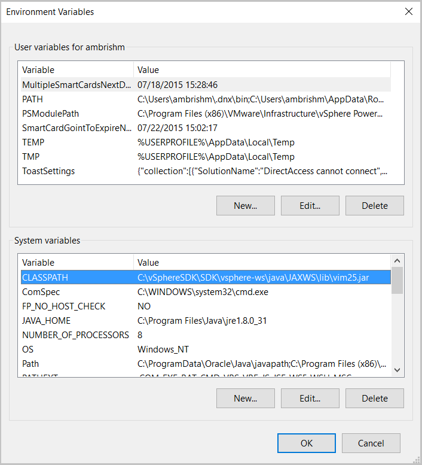
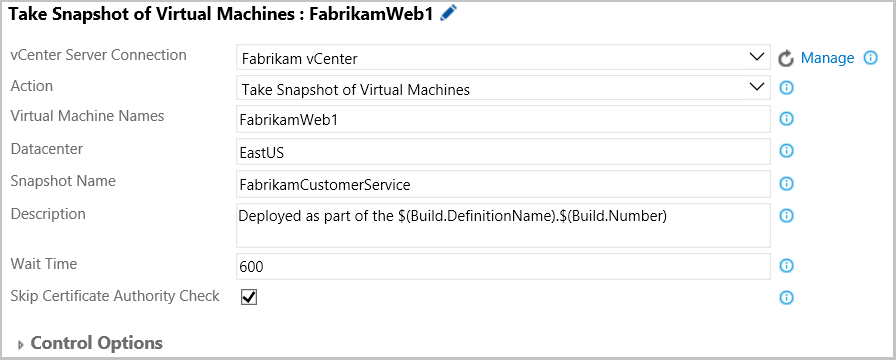
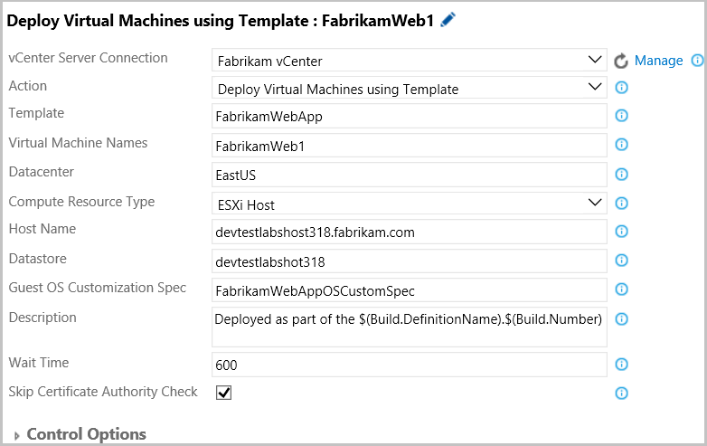

# **VMware Resource Deployment**

Connect to a VMware vCenter Server™ from Visual Studio Team Services or Team Foundation Server to provision, start, stop, or snapshot virtual machines. Currently, the following actions are available in the extension and others will be released in the future updates.

 - Deploy virtual machines using template.
 - Power on or delete virtual machines.
 - Take snapshot, or revert snapshot, or delete snapshot of virtual machines.

## **Usage**

The extension installs the following components:

 - A service endpoint for connecting to the vCenter Server.
 - A VMware Resource Deployment task, to deploy virtual machines, and to perform actions on them.

Follow the steps given below to setup the extension and to use it to deploy resources in VMWare.  

### **Install vSphere Management SDK on the Automation Agent's machine**

The extension uses the vSphere Management SDK, to call VMware API functions, to access vSphere Web services. Install and configure the SDK on the automation agent's machine as described below:

 1. Download and install the latest version of JRE™ or Java™ Runtime Environment from the [website](http://www.oracle.com/technetwork/java/javase/downloads/jre8-downloads-2133155.html).
 2. Create a directory for the vSphere Management SDK, like C:\vSphereSDK. Do not use spaces in the directory names to avoid issues with some of the included SDK batch and script files.
 3. Download the [vSphere 6.0 Management SDK](https://my.vmware.com/web/vmware/details?downloadGroup=MNGMTSDK600&productId=491) from the website. Login with existing credentials or register on the website to download the SDK.
 4. Unpack the vSphere Management SDK in the C:\vSphereSDK directory.
 5. Add the precompiled VMware JAVA SDK file, vim25.jar, to the machine's CLASSPATH environment variable - C:\vSphereSDK\SDK\vsphere-ws\java\JAXWS\lib\vim25.jar.

 

### **Create a vCenter Server Service endpoint**

Visual Studio Team Services or Team Foundation Server requires a service connection to a vCenter Server to deploy virtual machines.  

   1. Open the **Services** tab in your Visual Studio Team Services or Team Foundations Server **Control Panel**.

 

   2. From the **New Service Endpoint** list, select **VMware vCenter**.

 

   3. In the **Add New VMware vCenter Server Connection** pop-up dialog, provide the required details to connect to the vCenter Server:
     * Provide a user friendly name for the service endpoint in the **Connection Name** like **Fabrikam vCenter**.
     * Enter the **vCenter Server URL**, like **https://devtestlab325.fabrikam.com/**. Note that only **HTTPS** connections are supported.
     * Enter a **Username** and **Password** that has the required access to the vCenter Server. Press **OK** to create the connection.

 

### **Using VMware Resource Deployment task to take snapshots or revert or delete them**

 1. Open your build or release definition and add the VMware Resource Deployment task. The task can be found in the **Deploy** section of the **Add Tasks** dialog.

 

 2. To take snapshot of virtual machines, or to revert or delete them, fill-in the task parameters as described below:
    * **VMware Service Connection**: In the dropdown, select the VMware vCenter Server connection that was created above.
    * **Action**: Select any one of the snapshot actions from amongst **Take Snapshot of Virtual Machines**, or **Revert Snapshot of Virtual Machines**, or **Delete Snapshot of Virtual Machines**.
    * **Virtual Machines Name**: Provide the names of one or more virtual machines. For multiple machines use a comma separated list, like VM1, VM2, VM2.
    * **Datacenter**: Enter the name of the **Datacenter**, where the virtual machines are located.
    * **Snapshot Name**: Enter the name of the snapshot. Note that for the revert and delete snapshot actions, the snapshot should exist for the virtual machines, else the task will error out.
    * **Description**: Optionally, provide a description for the **Take Snapshot of Virtual Machines** action, like $(Build.DefinitionName).$(Build.BuildNumber). This can be used to track the particular run of the build or release definition that created the snapshot.
    * **Skip Certificate Authority Check**: If the vCenter Server's certificate is self-signed then select this option to skip the validation of the certificate from a trusted certificate authority. To check if the self-signed certificate is installed on the vCenter Server open the VMware vSphere® Web Client in a Web browser and look for certificate error screen. The vSphere Web Client URL will be similar to https://devtestlab325.fabrikam.com/vsphere-client/. For best practices regarding the vCenter Server certificates see the [website](https://kb.vmware.com/selfservice/microsites/search.do?language=en_US&cmd=displayKC&externalId=2057223).     

 

### **Using VMware Resource Deployment task to Power on Virtual Machines or to Delete them**

1. To power on virtual machines or to delete them, fill-in the task parameters as described below:
   * **VMware Service Connection**: In the dropdown, select the VMware vCenter Server connection that was created above.
   * **Action**: Select any one of the snapshot actions from amongst **Power on Virtual Machines**, or **Delete Virtual Machines**.
   * **Virtual Machines Name**: Provide the names of one or more virtual machines. For multiple machines use a comma separated list, like VM1, VM2, VM2.
   * **Datacenter**: Enter the name of the **Datacenter**, where the virtual machines are located.
   * **Skip Certificate Authority Check**: If the vCenter Server's certificate is self-signed then select this option to skip the validation of the certificate from a trusted certificate authority.

  

2. The **Power on Virtual Machines** action, waits till the guest operating system in the virtual machines has started. For this to work properly, VMware Tools™ needs to be installed in the guest operating system. If the VMware Tools are not installed, then the task will wait for 10 minutes after the virtual machines have powered on and return successfully.  

### **Using VMware Resource Deployment task to Deploy Virtual Machines using Template**

1. To deploy a virtual machine using a template, fill-in the task parameters as described below:
   * **VMware Service Connection**: In the dropdown, select the VMware vCenter Server connection that was created above.
   * **Action**: Select any one of the snapshot actions from amongst **Deploy Virtual Machines using Template**.
   * **Template**: The name of the template that will be used for creating the virtual machines.
   * **Virtual Machines Name**: Provide the names of one or more virtual machines. For multiple machines use a comma separated list, like VM1, VM2, VM2.
   * **Datacenter**: Enter the name of the **Datacenter**, where the virtual machines will be created.
   * **Compute Resource Type**: Select from the **VMware ESXi™ Host**, **Cluster**, or **Resource Pool**, where the virtual machines will be deployed.
   * **Host Name/Cluster Name/Resource Pool Name**: Enter the name of the ESXi Host, or the Cluster, or the Resource Pool.
   * **Datastore**: Enter the name of the datastore for storing the virtual machines configuration and disk files.
   * **Description**: Optionally, provide a description, like VMs for Fabrikam App Testing.
   * **Skip Certificate Authority Check**: If the vCenter Server's certificate is self-signed then select this option to skip the validation of the certificate from a trusted certificate authority.

  

### **Contact Information**

For further information or to resolve issues, contact RM_Customer_Queries at Microsoft dot com.

### **Trademarks**

 VMware, VMware vCenter Server, VMware vSphere Management SDK, VMware Tools, VMware vSphere Web Client, and VMware ESXi are registered trademark or trademarks of VMware, Inc. in the United States and/or other jurisdictions.

 Oracle and Java are registered trademarks of Oracle and/or its affiliates.
